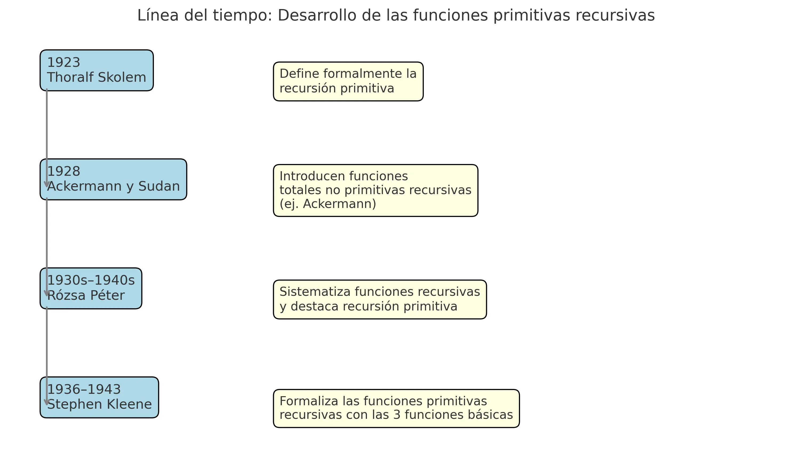

Las **funciones primitivas recursivas** son funciones total y computables que se construyen a partir de funciones básicas mediante dos operaciones: composición y recursión primitiva. Son fundamentales en la teoría de la computabilidad y fueron objeto de estudio mucho antes del desarrollo de las máquinas de Turing.

## 🧠 Los inicios: 1923 - Skolem

**Thoralf Skolem** fue el primero en definir formalmente la recursión primitiva en 1923. Lo hizo en el contexto de funciones aritméticas mecánicamente computables, aunque sin usar las funciones "cero", "sucesora" y "proyección" como base explícita.

## ✨ Funciones más allá de lo primitivo: 1928 - Ackermann y Sudan

**Wilhelm Ackermann** y **Gabriel Sudan** demostraron que existen funciones total y computables que **no** pueden ser definidas mediante recursión primitiva. El ejemplo clásico es la **función de Ackermann**, que crece más rápido que cualquier función primitiva recursiva.

## 📚 Sistematización: 1930s-40s - Rózsa Péter

**Rózsa Péter** desarrolló una teoría completa de funciones recursivas y destacó el papel de la recursión primitiva. Escribió el influyente libro *Recursive Functions* en 1951, donde se establece el uso sistemático de funciones iniciales.

## 🔄 Formalización moderna: 1936-1943 - Stephen Kleene

**Stephen Kleene** es el autor clave en la formalización moderna. Introdujo los términos "funciones primitivas recursivas" y definió rigurosamente que pueden ser construidas a partir de:

- La función **cero**: \( Z(n) = 0 \)
- La función **sucesora**: \( S(n) = n + 1 \)
- Las funciones de **proyección**: \( P^n_k(x_1, \dots, x_n) = x_k \)

Usando solo **composición** y **recursión primitiva**, estas tres funciones permiten generar toda la clase de funciones primitivas recursivas.

---

## 📊 Línea del tiempo visual

Esta línea del tiempo resume el desarrollo histórico:

- **1923**: Skolem introduce la recursión primitiva
- **1928**: Ackermann define una función no primitiva recursiva
- **1930s-40s**: Rózsa Péter sistematiza el estudio
- **1936-43**: Kleene formaliza completamente el concepto

---

Las funciones primitivas recursivas son una piedra angular de la computación formal. Aunque no abarcan todas las funciones computables (como lo demuestra la función de Ackermann), sí representan el subconjunto de funciones que son **totalmente deterministas, acotadas y siempre terminan**.

🔹 Si deseas explorar la jerarquía completa de funciones computables o cómo estas se relacionan con las máquinas de Turing, este es un gran punto de partida.
