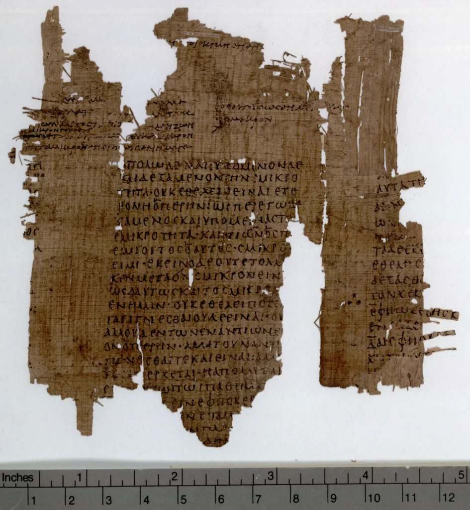

<figure>

<figcaption>

Oxford Papyrology (2022). P.Oxy. XV 1809. Plato, Phaedo. University of Oxford. Online resource. https://doi.org/10.25446/oxford.21133039.v1

</figcaption>

</figure>

Los Papiros de Oxirrinco son una colección monumental de manuscritos antiguos descubiertos en un sitio arqueológico en Oxirrinco (hoy El-Bahnasa), Egipto. Este descubrimiento, realizado a fines del siglo XIX, ha proporcionado una visión invaluable de la vida cotidiana, la literatura, la administración y la cultura del antiguo mundo grecorromano y bizantino.

### Historia del Descubrimiento

El hallazgo de los Papiros de Oxirrinco comenzó en 1896 cuando los arqueólogos británicos Bernard P. Grenfell y Arthur S. Hunt iniciaron excavaciones en el sitio. La elección de Oxirrinco no fue accidental; la ciudad, situada en el borde occidental del desierto egipcio, había sido un importante centro administrativo y cultural durante la era helenística, romana y bizantina. La ubicación del sitio y las condiciones secas del desierto contribuyeron a la excelente preservación de los papiros.

### Contenido de los Papiros

La colección de los Papiros de Oxirrinco incluye una variedad increíblemente diversa de textos. Estos pueden clasificarse en varias categorías:

1. **Literatura Clásica:**
   - ***Obras Perdidas y Conocidas:*** Los papiros han revelado textos que se creían perdidos, como fragmentos de obras de Sófocles, Eurípides y Menandro. También han aparecido copias de obras conocidas, como las de Homero, Hesíodo y Píndaro.
   - ***Nueva Literatura:*** Algunos textos literarios descubiertos eran completamente desconocidos antes del hallazgo en Oxirrinco, proporcionando nuevas perspectivas sobre la literatura y la cultura antiguas.

2. **Documentos Administrativos y Legales:**
   - ***Registros Oficiales:*** Los papiros contienen censos, contratos, registros fiscales, cartas oficiales y documentos administrativos que ofrecen una visión detallada de la organización y administración de la vida diaria en Oxirrinco.
   - ***Correspondencia Privada:*** Las cartas privadas entre individuos revelan aspectos personales y sociales de la vida cotidiana, como relaciones familiares, transacciones comerciales y asuntos legales.

3. **Textos Religiosos y Filosóficos:**
   - ***Textos Cristianos y Paganos:*** Se han encontrado fragmentos de textos religiosos, incluidos evangelios apócrifos, himnos cristianos y escritos teológicos, así como textos filosóficos de autores como Platón y Aristóteles.
   - ***Papiros Mágicos:*** Algunos papiros contienen fórmulas mágicas y rituales, reflejando prácticas religiosas y supersticiosas de la época.

4. **Textos Escolares:**
   - ***Material Educativo:*** Entre los papiros se encuentran ejercicios escolares, gramáticas, diccionarios y otros textos didácticos que ilustran el sistema educativo y las prácticas pedagógicas de la antigüedad.

### Importancia de los Papiros de Oxirrinco

Los Papiros de Oxirrinco son de enorme importancia para varios campos de estudio:

- **Filología y Literatura:** Proporcionan material nuevo para el estudio de la literatura clásica y la recuperación de textos perdidos.
- **Historia y Arqueología:** Ofrecen información detallada sobre la vida cotidiana, la administración y la estructura social en el mundo antiguo.
- **Religión y Filosofía:** Enriquecen el entendimiento de las creencias religiosas y las ideas filosóficas de las sociedades antiguas.
- **Lingüística:** Ayudan a comprender mejor la evolución del griego antiguo y otros idiomas utilizados en los textos.

### Conclusión

El descubrimiento de los Papiros de Oxirrinco ha sido uno de los hallazgos arqueológicos más significativos del mundo antiguo. La vasta colección de textos ha abierto una ventana al pasado, permitiendo a los estudiosos reconstruir aspectos de la vida, la cultura y el pensamiento del antiguo Egipto, Grecia y Roma. Con cada nuevo papiro traducido y analizado, se enriquece nuestra comprensión del legado de estas civilizaciones y su impacto duradero en la historia humana.
