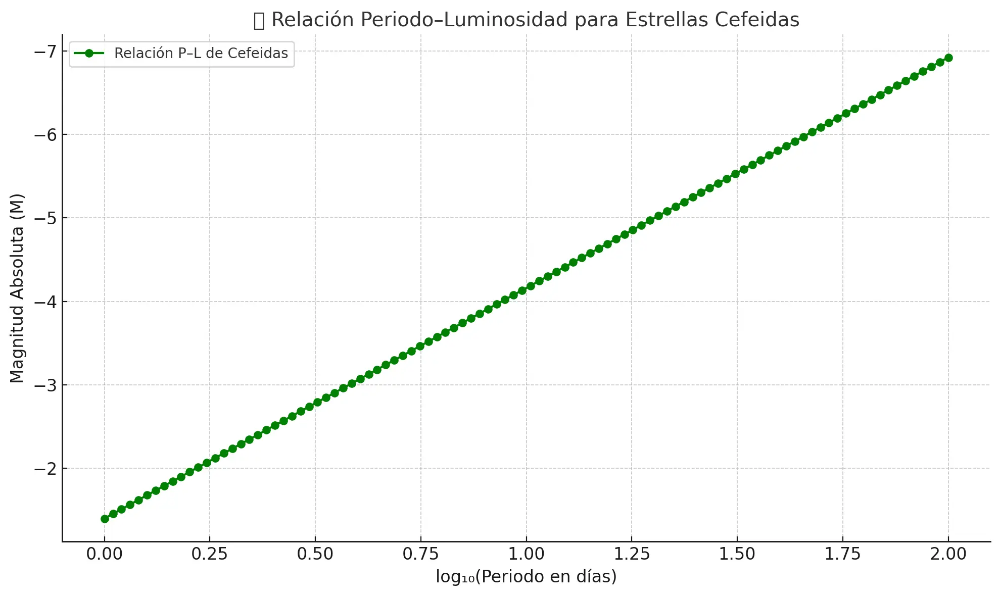

La relación Periodo–Luminosidad, descubierta por **Henrietta Swan Leavitt** a inicios del siglo XX, describe cómo el **periodo de pulsación** de una estrella Cefeida está directamente relacionado con su **luminosidad intrínseca**. Esta ley es fundamental para determinar distancias en el universo, especialmente en otras galaxias.

### ¿Qué dice la relación?

Cuanto más largo es el **periodo** de una estrella Cefeida (el tiempo que tarda en completar un ciclo de brillo), **más brillante** es su magnitud absoluta:

\[
M = a \cdot \log_{10}(P) + b
\]

Donde:
- \( M \) es la **magnitud absoluta** (luminosidad real)
- \( P \) es el **periodo** de pulsación (en días)
- \( a \) y \( b \) son constantes empíricas; por ejemplo, para Cefeidas clásicas en banda V:
  \[
  M_V \approx -2.76 \cdot \log_{10}(P) - 1.40
  \]

---

### 📊 Visualización

A continuación, se muestra un gráfico de esta relación usando una escala logarítmica para el periodo:

Como puede observarse, las estrellas con periodos más largos son **más luminosas** (tienen menor magnitud absoluta).

---

### 🧭 ¿Para qué sirve?

Una vez que sabemos el **periodo** de una Cefeida en otra galaxia:

1. Calculamos su **magnitud absoluta** (luminosidad real).
2. Medimos su **magnitud aparente** (cómo se ve desde la Tierra).
3. Aplicamos la **fórmula del módulo de distancia**:
   \[
   m - M = 5 \cdot \log_{10}(d) - 5
   \]
   para obtener la distancia \( d \) en parsecs.

Este método ha permitido:
- Calcular la distancia a galaxias como **Andrómeda**.
- Medir la expansión del universo.
- Fundar la **cosmología observacional moderna**.

---

### 👩‍🔬 Henrietta Leavitt

Leavitt trabajaba como “computadora humana” en el Observatorio de Harvard. Al analizar estrellas variables en la **Pequeña Nube de Magallanes**, donde todas están a una distancia similar, notó que las más brillantes tenían periodos más largos. Su hallazgo permitió más tarde a Edwin Hubble demostrar que el universo se expande.