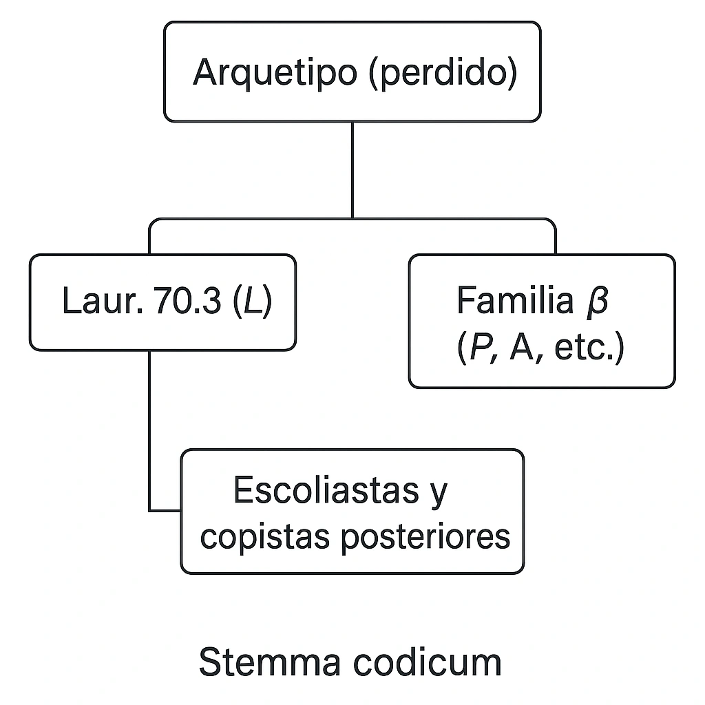

## 📜 Los manuscritos más importantes según Alberti

| Sigla | Nombre y signatura                     | Fecha        | Contenido           | Notas |
|-------|----------------------------------------|--------------|----------------------|-------|
| **L** | **Codex Laurentianus 70.3**            | siglo X      | Libros I–VII         | **Principal y más confiable**; incluye escolios |
| P     | Codex Parisinus 1732                   | siglo X–XI   | Libros I–VIII        | Cercano a L; buen testigo secundario |
| A     | Codex Vaticanus Graecus 131            | siglo XI     | Libros I–VIII        | Aporta variantes útiles; influyente |
| V     | Codex Venetus Marcianus 379            | siglo XII    | Libros I–VIII        | Menos preciso; utilizado como apoyo |
| E     | Codex Escorialensis Ψ.I.1              | siglo XI     | Libros I–VIII        | Lecturas independientes ocasionales |
| F     | Codex Florentinus Laur. 69.2           | siglo XIII   | Libros I–VIII        | Útil cuando L presenta lagunas o ambigüedades |

## 🧬 Stemma codicum (esquemático)

Alberti basa su edición crítica fundamentalmente en **L**, el códice **Laurentianus 70.3**, por ser el más antiguo, completo y confiable. Otros manuscritos sirven para corroborar variantes o suplir lagunas.

---

## 🧾 ¿Por qué Alberti elige el Codex Laurentianus 70.3?

En su edición crítica de *Thucydidis Historiae*, Giovanni Battista Alberti otorga **primacía absoluta al Codex Laurentianus 70.3 (L)** por varias razones técnicas y filológicas:

1. **Antigüedad**: Es el manuscrito más antiguo que conservamos, fechado en el siglo X. Su proximidad temporal al original perdido (siglo V a.C.) lo convierte en un testimonio privilegiado.

2. **Fidelidad textual**: Alberti subraya que L **presenta menos interpolaciones**, correcciones de copistas y errores sistemáticos que los manuscritos posteriores, muchos de los cuales parecen derivar de él indirectamente.

3. **Scholia y aparato marginal**: Este códice conserva una rica capa de **escolios bizantinos**, que proporcionan valiosas pistas sobre cómo fue interpretado y copiado el texto en siglos anteriores. Para Alberti, este contexto ayuda a establecer un aparato crítico más robusto.

4. **Autenticidad léxica**: L conserva formas gramaticales, vocabulario y giros sintácticos que, aunque difíciles, **coinciden con el estilo característico de Tucídides**, en lugar de mostrar las simplificaciones que aparecen en copias posteriores.

En resumen, Alberti se adscribe a una **filología conservadora**, que privilegia la transmisión más directa y menos manipulada del texto original.

---

## 📘 Comparación con la edición francesa de *Les Belles Lettres*

La monumental edición francesa de *La Guerre du Péloponnèse*, dirigida por **Jacqueline de Romilly**, **Raymond Weil** y **Louis Bodin**, publicada en seis volúmenes por **Les Belles Lettres** entre 1958 y 1972, adopta una postura ligeramente diferente:

1. **Ecléctica pero crítica**: Aunque reconocen la primacía de L, los editores franceses son **más eclécticos en su enfoque**, integrando con mayor libertad lecturas de otros manuscritos (P, A, E) cuando consideran que el sentido del pasaje lo requiere.

2. **Intervención filológica moderada**: De Romilly y sus colegas **no dudan en proponer correcciones conjecturales** si el texto transmitido parece corrompido o ilógico, mientras que Alberti prefiere mantener incluso las formas más oscuras cuando están atestiguadas por L.

3. **Orientación pedagógica**: La edición francesa tiene una vocación didáctica clara. Se acompaña de una **traducción francesa elegante y fluida**, notas explicativas extensas, y comentarios dirigidos tanto a especialistas como a lectores cultivados.

4. **Mayor sensibilidad literaria**: Mientras que Alberti se concentra en el plano textual y filológico, la edición francesa pone énfasis en la **coherencia estilística y retórica** de Tucídides, lo que en ocasiones los lleva a privilegiar la inteligibilidad sobre la literalidad.

---

## 📌 Conclusión

Ambas ediciones coinciden en reconocer la importancia capital del **Codex L**, pero difieren en su método:

- **Alberti**: Filología conservadora, edita desde L con mínimas enmiendas.
- **Les Belles Lettres**: Filología ecléctica, prioriza la claridad textual, aun a costa de modificar o suplir pasajes problemáticos.

Esta diferencia refleja una tensión clásica en la crítica textual: **¿conservar la dureza del original o facilitar su comprensión moderna?**
