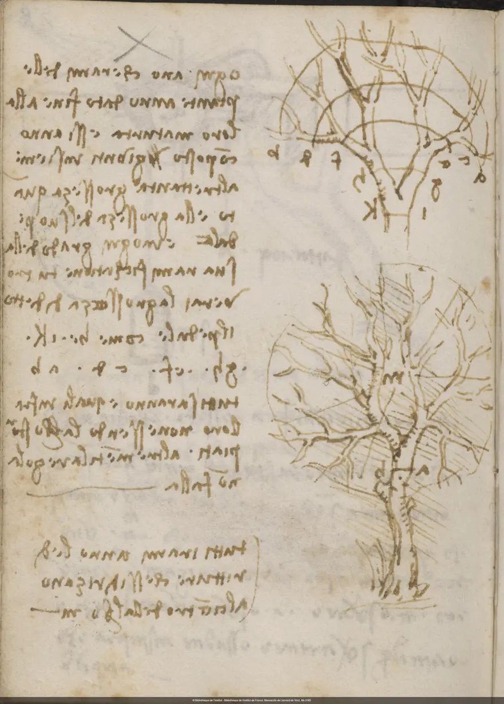

Los *Cuadernos de Leonardo da Vinci*, escritos entre 1478 y 1518, ofrecen una ventana privilegiada al pensamiento de uno de los genios más versátiles y profundos del Renacimiento. A lo largo de unas 13,000 páginas —dispersas hoy en varias colecciones conocidas como códices— Leonardo dejó constancia de su inagotable curiosidad intelectual y capacidad de observación: diseños de máquinas de guerra y de vuelo (como el célebre helicóptero o la ballesta gigante), estudios anatómicos, reflexiones filosóficas, teorías ópticas y pictóricas, y hasta listas de vocabulario científico y técnico.

Entre estas colecciones destacan el [Codex Arundel](http://www.bl.uk/manuscripts/FullDisplay.aspx?ref=Arundel_MS_263) (Biblioteca Británica), el [Codex Trivulzianus](https://trivulziana.milanocastello.it/en/content/leonardos-notebook) (Archivo Histórico de Milán), los tres *Códices Forster* (conservados en el [Museo Victoria & Albert](https://www.vam.ac.uk/articles/leonardo-da-vincis-notebooks)), y los [Códices Madrid](http://www.bne.es/en/Colecciones/Manuscritos/Leonardo/) (Biblioteca Nacional de España).

Uno de los hallazgos más fascinantes en estos manuscritos aparece en el *Manuscrito M*, el más pequeño de todos, conservado en la [Bibliothèque de l'Institut de France](https://bibnum.institutdefrance.fr/ark:/61562/bi24181). Allí, Leonardo formula lo que hoy conocemos como la **Regla de los Árboles**: una observación empírica sobre el grosor relativo de las ramas de un árbol. Según esta regla, el diámetro conjunto de todas las ramas de un árbol, a una determinada altura, es igual al diámetro del tronco o rama madre desde la que emergen.

> “Todas las ramas de un árbol en cada etapa de su altura, cuando se juntan, tienen el mismo grosor que el tronco [debajo de ellas].”  
> “Cada año, cuando las ramas de una planta [o árbol] hayan terminado de madurar su crecimiento, habrán formado, juntas, un espesor igual al del tallo principal...”
>  
> Fuente: *Manuscrit M*, folio 78v, Bibliothèque numérique de l'Institut de France.  
> [Imagen en alta resolución](https://bibnum.institutdefrance.fr/viewer/24181?viewer=picture#page=163&viewer=picture&o=bookmark&n=0&q=)

Desde una perspectiva moderna, esta regla puede interpretarse en términos matemáticos: el “grosor” al que se refería Leonardo puede entenderse como el **área de sección transversal** de las ramas. La sección transversal de un cilindro (como una rama) se calcula con la fórmula del área del círculo: \( A = \pi r^2 \). Si sumamos las áreas de todas las ramas hijas, estas equivaldrían aproximadamente al área del tronco madre si se cumple la regla. Esta formulación implica una conservación de flujo (de savia, energía o estructura) dentro del árbol.

Más de cinco siglos después, el físico francés **Christophe Eloy** retomó esta intuición de Leonardo en un artículo publicado en *Physical Review Letters* (2011). Utilizando simulaciones computacionales, Eloy demostró que la regla de los árboles no solo es válida en general, sino que además tiene una función biomecánica crucial: los árboles que respetan dicha proporción son más resistentes a los vientos fuertes, al distribuir mejor las tensiones mecánicas. Puedes consultar el estudio completo [aquí](https://journals.aps.org/prl/issues/107/25).

Un [estudio posterior](https://www.ncbi.nlm.nih.gov/pmc/articles/PMC3979699/) (2014), también basado en modelos computacionales, afinó aún más los resultados. Según los autores, la regla de Leonardo es válida en árboles reales cuando se dan ciertas condiciones geométricas: ángulos de ramificación pequeños y ramas laterales menos pesadas. Es decir, Leonardo había captado una ley estadística válida dentro de ciertos límites, mucho antes de que existiera la biomecánica moderna.

La belleza de los Cuadernos de Leonardo da Vinci radica precisamente en esa fusión entre observación artística, intuición física y curiosidad científica. Desde el arte hasta la botánica, desde la anatomía humana hasta los principios de la hidráulica, sus páginas reflejan una mente en perpetua exploración. La regla de los árboles es apenas un ejemplo más del tipo de conocimiento anticipado que aún hoy nos obliga a releer sus manuscritos con asombro renovado.

Leonardo no solo dibujó árboles: **los entendió**. Y, como en tantos otros campos, lo hizo siglos antes que nosotros.
